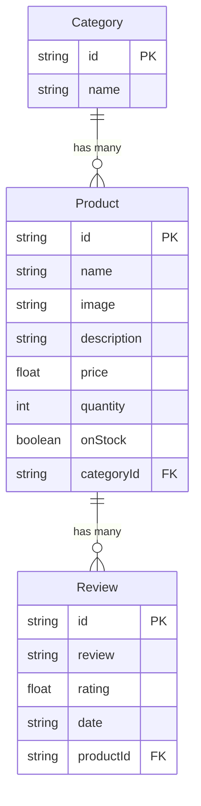

# 🚀 First GraphQL API with TypeScript & Apollo Server

Welcome to **First GraphQL**, a type-safe, lightweight GraphQL API built using **TypeScript**, **Apollo Server 5**, and **Node.js**. This project demonstrates the core concepts of GraphQL, including schema definitions (SDL), queries, mock database integration, and relational resolvers (one-to-many and nested relationships).

---

## 🌟 Features

- **Apollo Server v5**: Powered by the latest standalone Apollo Server for quick setup and playground sandbox interaction.
- **Strict TypeScript**: Fully configured TypeScript compilation for compile-time safety.
- **Relational Resolvers**: 
  - Products linked to their parent Categories.
  - Categories resolving list of associated Products.
  - Products displaying user Reviews.
- **Mock Database Integration**: In-memory JavaScript arrays representing `products`, `categories`, and `reviews` for instant execution without setting up a heavyweight database server.
- **Hot Reloading / Auto Compile**: Fully integrated watcher scripts compilation (`tsc -w`) paired with `nodemon` for active developer convenience.

---

## 📂 Project Structure

Below is the directory structure of the project, outlining the clean separation of concerns between schema declarations, database mock-ups, resolvers, and application entrypoint.

```text
first-graphql/
├── dist/                          # Compiled JavaScript output (ignored in Git)
├── src/                           # Source files
│   ├── gql/                       # GraphQL configuration files
│   │   ├── resolvers/             
│   │   │   └── index.ts           # Query and relational resolvers (Product, Category, etc.)
│   │   └── schema/                
│   │       └── index.ts           # Schema Definitions (typeDefs) using GraphQL SDL
│   ├── db.ts                      # In-memory mock database containing products, categories, & reviews data
│   └── index.ts                   # App entrypoint (initializes & starts Apollo Server on port 4000)
├── .gitignore                     # Git configuration files
├── package.json                   # Project scripts and dependencies definition
├── tsconfig.json                  # TypeScript compiler settings
├── yarn.lock                      # Dependency lockfile
└── README.md                      # Documentation (This file)
```

---

## 🛠️ Tech Stack & Dependencies

- **Runtime**: Node.js
- **Language**: TypeScript
- **GraphQL Engine**: Apollo Server (`@apollo/server`, `graphql`)
- **Developer Tools**: `nodemon` (auto restarts node server), `tsc` (compiler)

---

## 🚀 Getting Started

### 1. Prerequisites
Ensure you have [Node.js](https://nodejs.org/) (v16+ recommended) and either [Yarn](https://yarnpkg.com/) or [NPM](https://www.npmjs.com/) installed on your machine.

### 2. Clone and Install Dependencies
Navigate to the project directory and install the packages:

```bash
# Using Yarn
yarn install

# Or using NPM
npm install
```

### 3. Run the Development Server
To start development with watch compile and automatic server restart:

#### Option A: Running separately (Highly Recommended)
Open two terminal windows:
- **Terminal 1** (Watch and compile TS files to JS):
  ```bash
  yarn compile  # runs "tsc --w"
  ```
- **Terminal 2** (Run local server with nodemon auto-restart):
  ```bash
  yarn dev      # runs "nodemon ./dist/index.js"
  ```

#### Option B: Clean Start & Run (Single Command)
Builds/compiles once, then runs the server:
```bash
yarn start      # runs "npm run compile && node ./dist/index.js"
```

Once started, the server will output:
```text
🚀 Server ready at: http://localhost:4000/
```

Open `http://localhost:4000/` in your browser to launch the **Apollo Sandbox Explorer**, where you can visually write and test queries.

---

## 📐 GraphQL Schema (SDL)

The schema definitions can be found inside [src/gql/schema/index.ts](file:///f:/my-projects/GraphQL-Project/first-graphql/src/gql/schema/index.ts). Below are the defined types:

```graphql
type Product {
  id: ID!
  name: String
  image: String
  description: String
  price: Float
  quantity: Int
  onStock: Boolean
  categoryId: String
  category: Category
  reviews: [Review]
}

type Category {
  id: ID!
  name: String
  products: [Product]
}

type Review {
  id: ID!
  review: String
  rating: Float
  date: String
  productId: String
}

type Query {
  products: [Product]
  product(productId: ID!): Product
  categories: [Category]
  category(categoryId: ID!): Category
}
```

---

## 🔗 Database Relationships

The project models the following relational structures between entities:

### 1. Category ➡️ Products (One-to-Many)
* A **Category** can have multiple associated **Products** (One-to-Many).
* Solved in resolvers by matching the product's `categoryId` to the category's `id`.
* **GraphQL fields**: 
  - `Category.products` returns `[Product]`
  - `Product.category` returns a single `Category` (Many-to-One)

### 2. Product ➡️ Reviews (One-to-Many)
* A **Product** can accumulate multiple user **Reviews** (One-to-Many).
* Solved in resolvers by filtering reviews matching the product's `id` to the review's `productId`.
* **GraphQL fields**:
  - `Product.reviews` returns `[Review]`

### Relationship Diagram



---

## 🔍 Example GraphQL Queries

You can execute the following queries in the Apollo Sandbox. The expected JSON responses based on the mock data are also included below:

### 1. Fetch All Products with Nested Category & Reviews
Fetches all products and resolves the nested categories and reviews details for each product.

**Query:**
```graphql
query GetAllProducts {
  products {
    id
    name
    price
    onStock
    category {
      id
      name
    }
    reviews {
      id
      review
      rating
    }
  }
}
```

**Response (Sample/Truncated):**
```json
{
  "data": {
    "products": [
      {
        "id": "2a089dca-d882-4305-9e25-d1dfeb93fd12",
        "name": "Basketball",
        "price": 29.99,
        "onStock": true,
        "category": {
          "id": "4f7f61e5-96c2-445d-80fb-79f58e3d061b",
          "name": "Sports"
        },
        "reviews": [
          {
            "id": "bd23fdc4-0636-4199-ad18-7ca9870e855f",
            "review": "Great basketball for playing with friends!",
            "rating": 4.5
          }
        ]
      },
      {
        "id": "73b8ca8b-ca88-483e-99ea-2fedaf2a1dc1",
        "name": "Football",
        "price": 19.99,
        "onStock": true,
        "category": {
          "id": "4f7f61e5-96c2-445d-80fb-79f58e3d061b",
          "name": "Sports"
        },
        "reviews": [
          {
            "id": "58db016e-0293-49cc-bf42-9384f8bccaef",
            "review": "The football is of good quality and lasts long.",
            "rating": 4
          }
        ]
      }
    ]
  }
}
```

---

### 2. Fetch a Single Product by ID

**Query:**
```graphql
query GetSingleProduct($productId: ID!) {
  product(productId: $productId) {
    name
    price
    description
    quantity
    category {
      name
    }
  }
}
```

**Variables:**
```json
{
  "productId": "2a089dca-d882-4305-9e25-d1dfeb93fd12"
}
```

**Response:**
```json
{
  "data": {
    "product": {
      "name": "Basketball",
      "price": 29.99,
      "description": "An official size basketball for both indoor and outdoor play.",
      "quantity": 30,
      "category": {
        "name": "Sports"
      }
    }
  }
}
```

---

### 3. Fetch All Categories with Nested Products list

**Query:**
```graphql
query GetCategoriesAndProducts {
  categories {
    id
    name
    products {
      id
      name
      price
    }
  }
}
```

**Response (Sample/Truncated):**
```json
{
  "data": {
    "categories": [
      {
        "id": "4f7f61e5-96c2-445d-80fb-79f58e3d061b",
        "name": "Sports",
        "products": [
          {
            "id": "2a089dca-d882-4305-9e25-d1dfeb93fd12",
            "name": "Basketball",
            "price": 29.99
          },
          {
            "id": "73b8ca8b-ca88-483e-99ea-2fedaf2a1dc1",
            "name": "Football",
            "price": 19.99
          }
        ]
      },
      {
        "id": "1b6c2e31-2e03-4487-bedd-d1139c7e5571",
        "name": "Mobile phones",
        "products": [
          {
            "id": "42ebd257-b37d-4751-96cd-f160c12a3c28",
            "name": "Smartphone",
            "price": 599.99
          }
        ]
      }
    ]
  }
}
```

---

### 4. Fetch a Single Category

**Query:**
```graphql
query GetSingleCategory {
  category(categoryId: "1b6c2e31-2e03-4487-bedd-d1139c7e5571") {
    id
    name
    products {
      name
      price
    }
  }
}
```

**Response:**
```json
{
  "data": {
    "category": {
      "id": "1b6c2e31-2e03-4487-bedd-d1139c7e5571",
      "name": "Mobile phones",
      "products": [
        {
          "name": "Smartphone",
          "price": 599.99
        },
        {
          "name": "Laptop",
          "price": 899.99
        },
        {
          "name": "Tablet",
          "price": 349.99
        },
        {
          "name": "Fitness Tracker",
          "price": 79.99
        }
      ]
    }
  }
}
```

